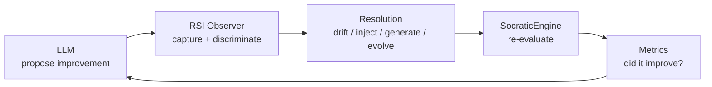
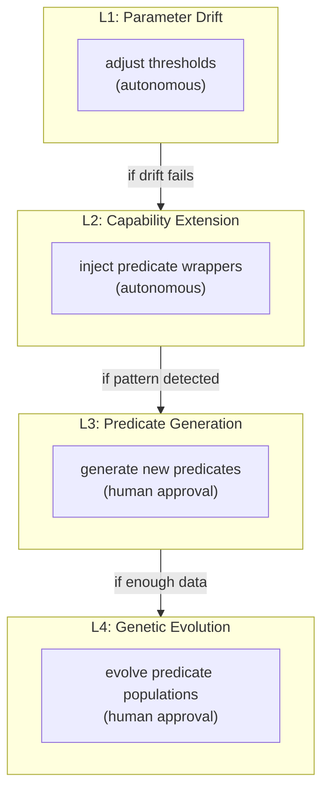
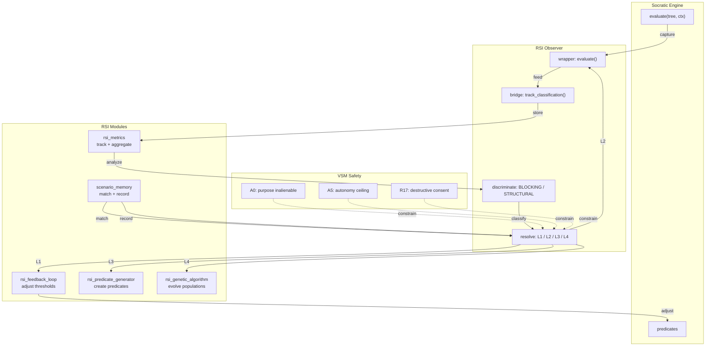
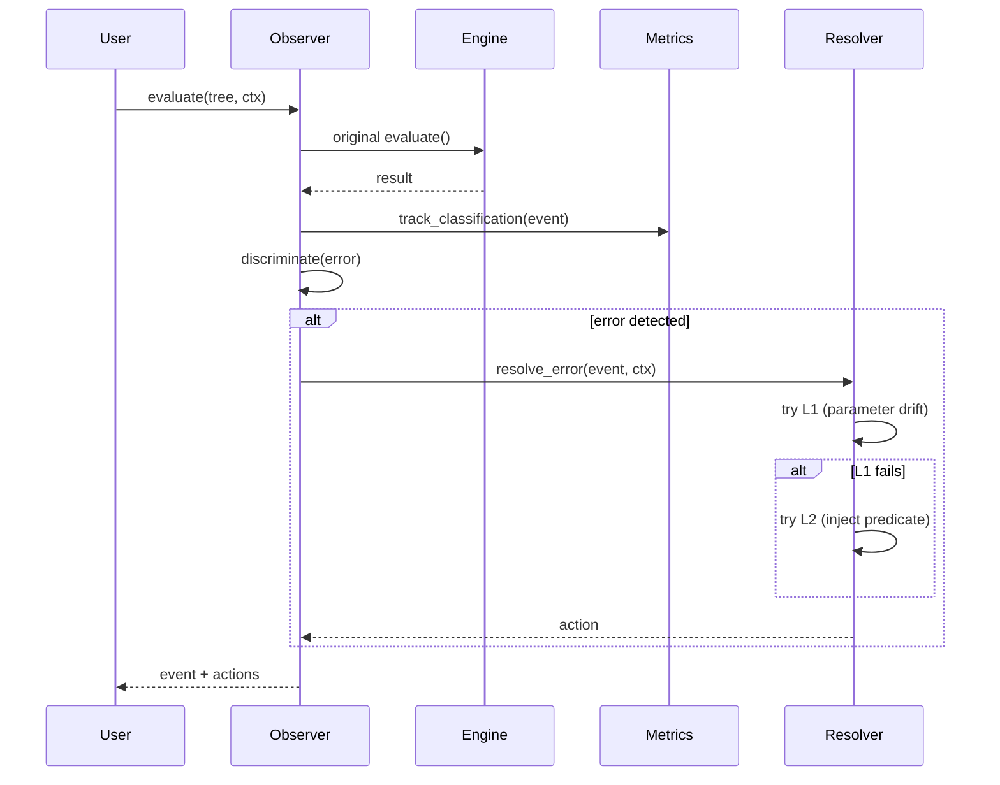
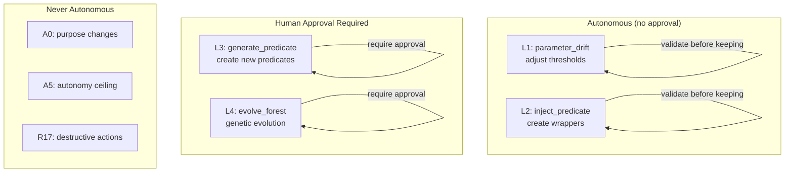

# vsf-rsi — Recursive Self-Improvement for VSM systems

[](https://github.com/rm-w3kufe/vsf-rsi/actions/workflows/ci.yml)
[](https://www.python.org/downloads/)
[](LICENSE)
[](https://github.com/rm-w3kufe/vsf-rsi/releases)
[](https://pypi.org/project/vsf-rsi/)
[](https://pypi.org/project/socratic-engine/)
[]()

> **Don't ask the language model to improve itself. Give the improvement a substrate.**

`vsf-rsi` is a cybernetic feedback loop that observes, evaluates, and improves socratic-engine predicates and trees through four levels of recursive self-improvement (RSI).

The system is deliberately bounded. It does not try to make the AI "smarter" unboundedly. It gives the system a formal structure in which improvements can be proposed, executed, validated, and rolled back — all within VSM safety constraints.

**Status:** v0.2.0 — Validation milestone achieved. 708 tests, 99% coverage.

---

## Installation

```bash
pip install vsf-rsi
```

With socratic-engine (required dependency):

```bash
pip install vsf-rsi socratic-engine
```

From source:

```bash
git clone https://github.com/rm-w3kufe/vsf-rsi.git
cd vsf-rsi
pip install -e ".[dev]"
```

---

## The bet

LLMs are excellent at proposing solutions. They are less reliable when they must **implicitly improve their own evaluation criteria while simultaneously maintaining safety guarantees**.

The bet here is simple:

> **Let the model propose improvements. Let a deterministic substrate validate and execute them. The model does not certify its own improvements.**



This creates a division of labour:

| Component | Responsibility |
|---|---|
| **LLM** | propose improvements, interpret results |
| **Observer** | capture evaluations, discriminate error classes |
| **Resolver** | apply appropriate RSI level (L1-L4) |
| **SocraticEngine** | re-evaluate with improved predicates/trees |
| **Metrics** | track whether improvement actually happened |
| **VSM Safety** | enforce autonomy ceiling, human approval gates |

The central boundary is:

> **The LLM proposes. The substrate validates. The LLM does not self-certify.**

---

## What it is

At its core, vsf-rsi provides:

- **Observer** (`rsi_observer.py`) — wraps `SocraticEngine.evaluate()` to capture every evaluation event, discriminate errors, and resolve them through L1-L4
- **Bridge** (`rsi_bridge.py`) — integrates with `state-canon-mcp` for canonical state queries, metrics feedback, and rule enforcement
- **Metrics** (`rsi_metrics.py`) — tracks classification history, accuracy, latency, and threshold adjustments
- **Feedback Loop** (`rsi_feedback_loop.py`) — manages threshold adjustments with drift bounds and step limits
- **Scenario Memory** (`scenario_memory.py`) — procedural learning: records failures with correction paths, matches novel faults to prior corrections
- **Gap Detector** (`rsi_gap_detector.py`) — detects evaluation gaps: stale predicates, missing branches, low accuracy
- **Pattern Detector** (`rsi_pattern_detector.py`) — identifies recurring error patterns with time-based decay (10%/day)
- **Predicate Generator** (`rsi_predicate_generator.py`) — creates new predicates from error patterns (with AST validation)
- **Tree Generator** (`rsi_tree_generator.py`) — generates evaluation trees from gap analysis
- **Forest Generator** (`rsi_forest_generator.py`) — generates populations of trees for genetic evolution
- **Genetic Algorithm v1** (`rsi_genetic_algorithm.py`) — evolves predicate populations with tournament selection, crossover, mutation, and convergence detection
- **Genetic Algorithm v2** (`rsi_genetic_algorithm_v2.py`) — improved GA with adaptive mutation rates
- **Tree Registry** (`rsi_tree_registry.py`) — manages predicate versions, prevents conflicts, tracks lineage
- **Component Registry** (`rsi_component_registry.py`) — maps package components to their roles and dependencies
- **Manifest Parser** (`rsi_manifest_parser.py`) — parses RSI manifest files for tree/predicate registration
- **Demo** (`rsi_demo.py`) — runnable demo: generate → evaluate → evolve → measurable improvement
- **Error Recovery** — system continues with degraded functionality on failures (never crashes)
- **Logging** — structured logging via `logging.getLogger("vsf_rsi.observer")`

### The four levels of RSI



| Level | What | Autonomous? | Safety |
|---|---|---|---|
| **L1** | Adjust existing thresholds | ✓ Yes | Reversible (JSON) |
| **L2** | Create wrapper predicates | ✓ Yes | Validated before keeping |
| **L3** | Generate new predicates | ✗ No | Human approval required |
| **L4** | Evolve predicate populations | ✗ No | Human approval required |

### state-canon-mcp integration

The `rsi_bridge` module provides functions to integrate with the state canon:

```python
from vsf_rsi.rsi_bridge import get_rsi_rules, query_canon, feed_metrics_to_canon

# Get rules that constrain RSI behavior
rules = get_rsi_rules()

# Query canonical state
result = query_canon("rsi_metrics", {"predicate": "stasis_check"})

# Feed metrics back to state canon
feed_metrics_to_canon({"total_evaluations": 100, "error_rate": 0.05})
```

---

## CLI usage

Each module has its own CLI entry point:

```bash
# Feedback loop — adjust thresholds
python -m vsf_rsi.rsi_feedback_loop adjust
python -m vsf_rsi.rsi_feedback_loop status
python -m vsf_rsi.rsi_feedback_loop history

# Pattern detector — analyze error patterns
python -m vsf_rsi.rsi_pattern_detector detect
python -m vsf_rsi.rsi_pattern_detector detect --predicate stasis_check
python -m vsf_rsi.rsi_pattern_detector summary

# Gap detector — find evaluation gaps
python -m vsf_rsi.rsi_gap_detector detect
python -m vsf_rsi.rsi_gap_detector gaps

# Tree generator — create trees from gaps
python -m vsf_rsi.rsi_tree_generator generate
python -m vsf_rsi.rsi_tree_generator list

# Forest generator — create populations for GA
python -m vsf_rsi.rsi_forest_generator generate --predicate stasis_check
python -m vsf_rsi.rsi_forest_generator evolve --predicate stasis_check
python -m vsf_rsi.rsi_forest_generator best --predicate stasis_check
python -m vsf_rsi.rsi_forest_generator list

# Component registry — manage components
python -m vsf_rsi.rsi_component_registry list
```

---

## Demo

Run the complete end-to-end demo:

```bash
python -m vsf_rsi.rsi_demo
```

The demo demonstrates the full RSI cycle:
1. Creates an SocraticEngine with built-in predicates
2. Runs 10 evaluations (mix of passes and failures)
3. Records failures in scenario_memory
4. Matches novel faults to prior corrections
5. Applies scenario_memory corrections to improve results
6. Generates patterns from error history
7. Evolves predicate populations with the genetic algorithm
8. Reports measurable improvement

---

## Testing

```bash
# Run full suite (708 tests, 99% coverage)
pytest tests/ -v

# Run with coverage
pytest tests/ --cov=vsf_rsi --cov-report=term-missing

# Run integration tests only (requires socratic-engine)
pytest tests/test_rsi_observer_integration.py -v

# Run scenario_memory integration test
pytest tests/test_scenario_memory_integration.py -v
```

---

## Architecture



---

## Quick start

```python
from vsf_rsi import RSIObserver, RSIMode
from socratic_engine import SocraticEngine

# Create engine with predicates
engine = SocraticEngine()

@engine.register("my_predicate")
def my_predicate(ctx, threshold=0.5, **kw):
    val = ctx.get("value", 0.0)
    from socratic_engine.engine import PredicateResult, Truth
    return PredicateResult(
        truth=Truth.TRUE if val > threshold else Truth.FALSE,
        certified=True,
        evidence={"value": val},
        source="my_predicate",
    )

# Create observer
observer = RSIObserver(engine, mode=RSIMode.CAPABILITY.value)

# Evaluate a tree
tree = {"predicate": "my_predicate", "args": ["$ctx", 0.5]}
ctx = {"task_id": "example", "value": 0.3, "input_value": 0.3}
event = observer.evaluate(tree, ctx)

# Check what happened
print(f"Error: {event.is_error}")
print(f"Class: {event.error_class}")

# Run pattern analysis
patterns = observer.analyze_patterns()
print(f"Patterns: {len(patterns)}")

# Generate predicates from patterns
actions = observer.generate_predicates(min_occurrences=3)
print(f"Generated: {len(actions)}")
```

---

## Integration with socratic-engine

vsf-rsi depends on `socratic-engine` as its recursive evaluation substrate. The integration is via the observer wrapper:



---

## Integration with agent systems

vsf-rsi is designed to be used by any AI agent or human operator. Here's how to integrate it:

### Available tools

| Tool | What it does | Install |
|------|--------------|---------|
| `socratic-engine` | Evaluates logical trees (decisions) | `pip install socratic-engine` |
| `state-canon-mcp` | Provides ground truth about system state | Run MCP server |
| `vsf-rsi` | Records and learns from patterns | `pip install vsf-rsi` |

### Integration by platform

#### OpenCode

Add to your `opencode.json`:

```json
{
  "mcp": {
    "socratic-engine": {
      "type": "local",
      "command": ["python3", "/path/to/socratic_mcp_with_bridge.py"]
    },
    "state-canon": {
      "type": "local",
      "command": ["python3", "/path/to/mcp_server.py", "--instance", "/path/to/your_state.py"]
    }
  }
}
```

Then use in your agent:

```python
# Agent calls these via MCP tools
from socratic_engine import SocraticEngine
from vsf_rsi.scenario_memory import record

# Evaluate a decision
engine = SocraticEngine()
result = engine.evaluate(your_tree, your_context)

# Record what happened
record({
    "fault_signature": "what_went_wrong",
    "decision": "what_you_did",
    "outcome": "success_or_failure"
})
```

#### Claude Code

Add to your `CLAUDE.md`:

```markdown
## Tools available

- `socratic_engine.evaluate(tree, context)` — evaluate decisions
- `state_canon.query(domain, filter)` — get ground truth
- `vsf_rsi.record(pattern)` — learn from outcomes
```

#### Perplexity / ChatGPT / Other agents

Install the packages:

```bash
pip install socratic-engine vsf-rsi
git clone https://github.com/rm-w3kufe/state-canon-mcp.git
```

Use in your code:

```python
from socratic_engine import SocraticEngine
from vsf_rsi.scenario_memory import record

# Evaluate
engine = SocraticEngine()
result = engine.evaluate(tree, context)

# Learn
record({"fault": "error", "fix": "solution", "outcome": "success"})
```

#### Human operator

```bash
# Install
pip install socratic-engine vsf-rsi

# Use CLI
python -m socratic_engine evaluate tree.json --context ctx.json
python -m vsf_rsi.scenario_memory record --fault "error" --fix "solution"
```

### Full pattern with other tools

```python
# 1. Get ground truth from state-canon
from state_canon import StateCanon
canon = StateCanon()
state = canon.query("services", {"name": "api"})

# 2. Evaluate decision with socratic-engine
from socratic_engine import SocraticEngine
engine = SocraticEngine()
result = engine.evaluate(tree, {"state": state})
print(result.certified, result.explain)

# 3. Record pattern with vsf-rsi
from vsf_rsi.scenario_memory import record, match
record({"fault_signature": "timeout", "decision": "increase", "outcome": "success"})
matches = match({"fault_signature": "timeout"})
```

For the full integration guide, see [Integration with agent systems](#integration-with-agent-systems).

---

## Safety model

The VSM safety constraints are enforced at every level:



Key safety properties:
- **A0/A0.1**: Purpose is inalienable — RSI cannot change system purpose
- **A5**: Autonomy ceiling — L1 is autonomous, L2+ requires validation
- **R17**: Destructive actions always require explicit human consent
- **R4**: Trust requires independent check — RSI cannot self-certify

---

## Roadmap

See [ROADMAP.md](ROADMAP.md) for detailed version history and future plans.

### v0.2.0 — Validation (current) ✅
- [x] 50 real evaluations processed
- [x] 1 threshold adjustment applied
- [x] 10 runs processed, 1 improvement via scenario_memory
- [x] End-to-end test: generate → evaluate → evolve → measurable improvement
- [x] Integration with state-canon-mcp
- [x] All 16 rsi_*.py mapped to package components
- [x] Coverage ≥90% (actual: 99%)

### v0.3.0 — Production
- [ ] Dashboard for observation
- [ ] Cross-validation
- [ ] Overfitting detection
- [ ] 5 components generated, 3 approved, 2 measurable improvements
- [ ] GA produces trees with fitness > 0.7 on real benchmark

---

## Lineage & philosophy

Built on Stafford Beer's **Viable System Model** and the **Cybersyn** project (Chile, 1971) — a system is
viable when it can be *described*, *governed*, and *audited*. "Don't trust, verify" isn't a slogan here;
it's the reconciler and the verify-at-every-boundary discipline made mechanical. Community-first, and
deliberately **from the Global South** — the heir to Cybersyn's bet that good cybernetics serves people.

## License

Code: **Apache-2.0** ([LICENSE](./LICENSE)) · Docs: **CC-BY-4.0**.

This module is deliberately more permissive than the AGPL core it was extracted from — it is meant to be
adopted, embedded, and improved by the community. Improvements can flow back; the module stays clean of
AGPL code by construction.
