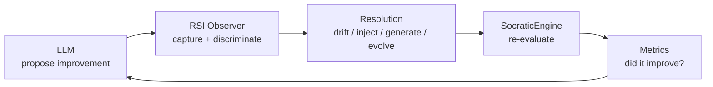
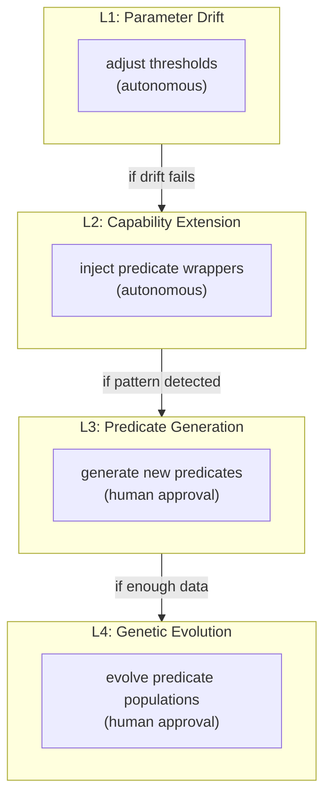
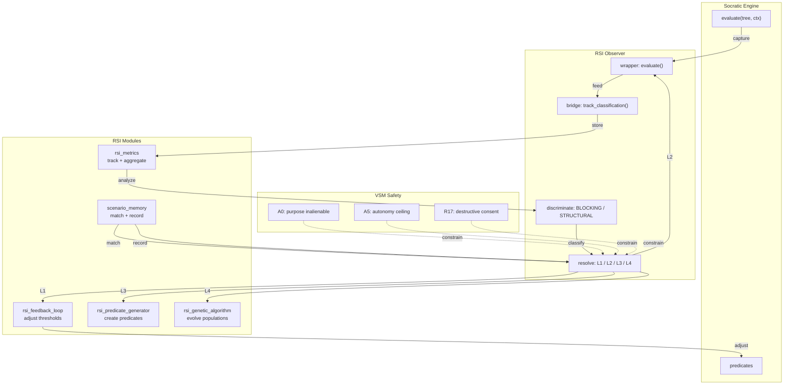
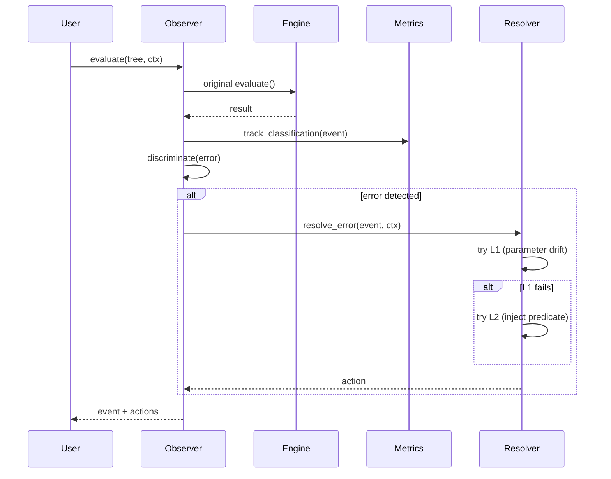
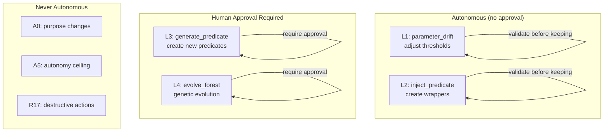

# vsf-rsi — Recursive Self-Improvement for VSM systems

[](https://github.com/rm-w3kufe/vsf-rsi/actions/workflows/ci.yml)
[](https://www.python.org/downloads/)
[](LICENSE)
[](https://github.com/rm-w3kufe/vsf-rsi/releases)
[](https://pypi.org/project/vsf-rsi/)
[](https://pypi.org/project/socratic-engine/)

> **Don't ask the language model to improve itself. Give the improvement a substrate.**

`vsf-rsi` is a cybernetic feedback loop that observes, evaluates, and improves socratic-engine predicates and trees through four levels of recursive self-improvement (RSI).

The system is deliberately bounded. It does not try to make the AI "smarter" unboundedly. It gives the system a formal structure in which improvements can be proposed, executed, validated, and rolled back — all within VSM safety constraints.

**Status:** v0.1.9 — state-canon-mcp integration, extended capabilities, installation instructions. 63 tests passing.

---

## Installation

```bash
pip install vsf-rsi
```

With socratic-engine (required dependency):

```bash
pip install vsf-rsi socratic-engine
```

From source:

```bash
git clone https://github.com/rm-w3kufe/vsf-rsi.git
cd vsf-rsi
pip install -e ".[dev]"
```

---

## The bet

LLMs are excellent at proposing solutions. They are less reliable when they must **implicitly improve their own evaluation criteria while simultaneously maintaining safety guarantees**.

The bet here is simple:

> **Let the model propose improvements. Let a deterministic substrate validate and execute them. The model does not certify its own improvements.**



This creates a division of labour:

| Component | Responsibility |
|---|---|
| **LLM** | propose improvements, interpret results |
| **Observer** | capture evaluations, discriminate error classes |
| **Resolver** | apply appropriate RSI level (L1-L4) |
| **SocraticEngine** | re-evaluate with improved predicates/trees |
| **Metrics** | track whether improvement actually happened |
| **VSM Safety** | enforce autonomy ceiling, human approval gates |

The central boundary is:

> **The LLM proposes. The substrate validates. The LLM does not self-certify.**

---

## What it is

At its core, vsf-rsi provides:

- **Observer** — wraps `SocraticEngine.evaluate()` to capture every evaluation event
- **Bridge** — integrates with `state-canon-mcp` for canonical state queries and metrics feedback
- **Discriminator** — classifies errors as BLOCKING or STRUCTURAL
- **Resolver** — applies the appropriate improvement level (L1-L4)
- **Scenario Memory** — records and matches past corrections (optional, requires `scenario_memory`)
- **Predicate Generator** — creates new predicates from error patterns (with syntax validation)
- **Genetic Algorithm** — evolves populations of predicates (with convergence checks)
- **Pattern Detector** — identifies recurring errors (with time-based decay)
- **Tree Registry** — manages predicate versions and prevents conflicts
- **Error Recovery** — system continues with degraded functionality on failures
- **Logging** — structured logging for debugging and monitoring

### The four levels of RSI



| Level | What | Autonomous? | Safety |
|---|---|---|---|
| **L1** | Adjust existing thresholds | ✓ Yes | Reversible (JSON) |
| **L2** | Create wrapper predicates | ✓ Yes | Validated before keeping |
| **L3** | Generate new predicates | ✗ No | Human approval required |
| **L4** | Evolve predicate populations | ✗ No | Human approval required |

### state-canon-mcp integration

The `rsi_bridge` module provides functions to integrate with the state canon:

```python
from vsf_rsi.rsi_bridge import get_rsi_rules, query_canon, feed_metrics_to_canon

# Get rules that constrain RSI behavior
rules = get_rsi_rules()

# Query canonical state
result = query_canon("rsi_metrics", {"predicate": "stasis_check"})

# Feed metrics back to state canon
feed_metrics_to_canon({"total_evaluations": 100, "error_rate": 0.05})
```

---

## Architecture



---

## Quick start

```python
from vsf_rsi import RSIObserver, RSIMode
from socratic_engine import SocraticEngine

# Create engine with predicates
engine = SocraticEngine()

@engine.register("my_predicate")
def my_predicate(ctx, threshold=0.5, **kw):
    val = ctx.get("value", 0.0)
    from socratic_engine.engine import PredicateResult, Truth
    return PredicateResult(
        truth=Truth.TRUE if val > threshold else Truth.FALSE,
        certified=True,
        evidence={"value": val},
        source="my_predicate",
    )

# Create observer
observer = RSIObserver(engine, mode=RSIMode.CAPABILITY.value)

# Evaluate a tree
tree = {"predicate": "my_predicate", "args": ["$ctx", 0.5]}
ctx = {"task_id": "example", "value": 0.3, "input_value": 0.3}
event = observer.evaluate(tree, ctx)

# Check what happened
print(f"Error: {event.is_error}")
print(f"Class: {event.error_class}")

# Run pattern analysis
patterns = observer.analyze_patterns()
print(f"Patterns: {len(patterns)}")

# Generate predicates from patterns
actions = observer.generate_predicates(min_occurrences=3)
print(f"Generated: {len(actions)}")
```

---

## Integration with socratic-engine

vsf-rsi depends on `socratic-engine` as its recursive evaluation substrate. The integration is via the observer wrapper:



---

## Safety model

The VSM safety constraints are enforced at every level:



Key safety properties:
- **A0/A0.1**: Purpose is inalienable — RSI cannot change system purpose
- **A5**: Autonomy ceiling — L1 is autonomous, L2+ requires validation
- **R17**: Destructive actions always require explicit human consent
- **R4**: Trust requires independent check — RSI cannot self-certify

---

## Roadmap

See [ROADMAP.md](ROADMAP.md) for detailed version history and future plans.

### v0.1.9 — Integration (current)
- [x] 1 threshold adjustment applied
- [x] End-to-end test: generate → evaluate → evolve → measurable improvement (50% → 0%)
- [x] Integration with state-canon-mcp (rsi_bridge.py)
- [x] Extended capabilities in README

### v0.2.0 — Validation
- [ ] 50 real evaluations processed
- [ ] 10 runs processed, 1 improvement via scenario_memory
- [ ] All 16 rsi_*.py mapped to package components
- [ ] Coverage ≥90%

### v0.3.0 — Production
- [ ] Dashboard for observation
- [ ] Cross-validation
- [ ] Overfitting detection
- [ ] GA produces trees with fitness > 0.7 on real benchmark

---

## License

Apache-2.0
