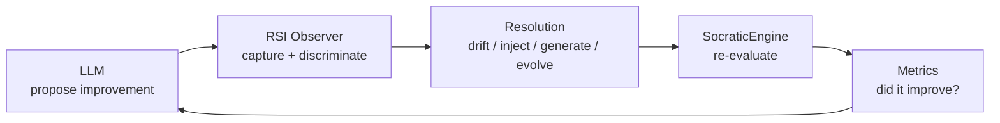
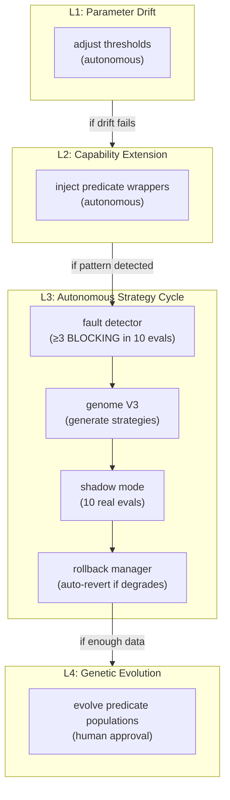
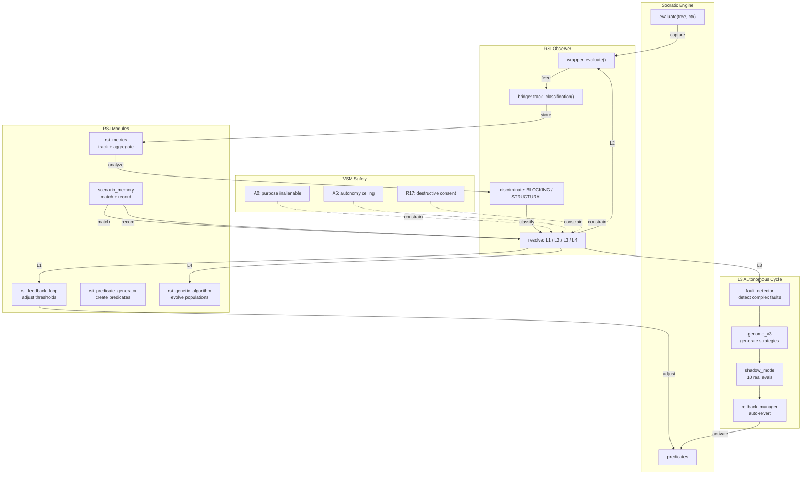
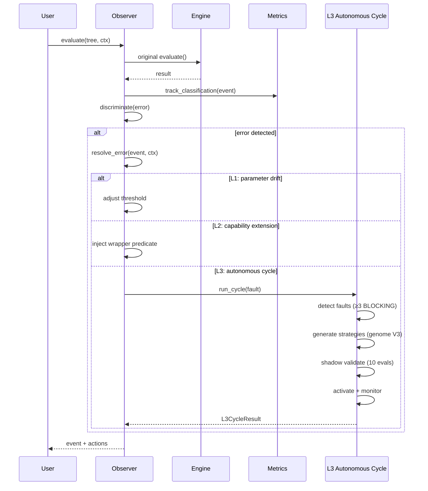
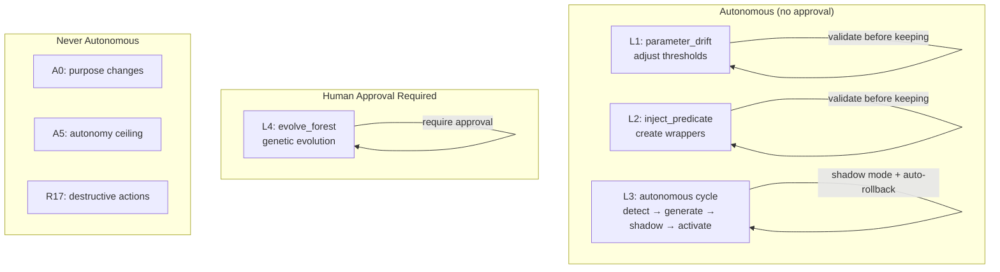

# vsf-rsi — Recursive Self-Improvement for VSM systems

[](https://github.com/rm-w3kufe/vsf-rsi/actions/workflows/ci.yml)
[](https://www.python.org/downloads/)
[](LICENSE)
[](https://github.com/rm-w3kufe/vsf-rsi/releases)
[](https://pypi.org/project/vsf-rsi/)
[](https://pypi.org/project/socratic-engine/)
[](https://github.com/rm-w3kufe/vsf-rsi/actions/workflows/ci.yml)

> **Don't ask the language model to improve itself. Give the improvement a substrate.**

`vsf-rsi` is a cybernetic feedback loop that observes, evaluates, and improves socratic-engine predicates and trees through four levels of recursive self-improvement (RSI). It uses a **Genetic Algorithm (GA)** to evolve predicate structures through feature construction and decision trees.

The system is deliberately bounded. It does not try to make the AI "smarter" unboundedly. It gives the system a formal structure in which improvements can be proposed, executed, validated, and rolled back — all within VSM safety constraints.

**Status:** v0.2.12 — Runtime predicate management. 858 tests. RSI pipeline-generated predicates gitignored; seeds tracked, learned state backed up externally.

---

## Installation

```bash
pip install vsf-rsi
```

With socratic-engine (required dependency):

```bash
pip install vsf-rsi socratic-engine
```

From source:

```bash
git clone https://github.com/rm-w3kufe/vsf-rsi.git
cd vsf-rsi
pip install -e ".[dev]"
```

---

## The bet

LLMs are excellent at proposing solutions. They are less reliable when they must **implicitly improve their own evaluation criteria while simultaneously maintaining safety guarantees**.

The bet here is simple:

> **Let the model propose improvements. Let a deterministic substrate validate and execute them. The model does not certify its own improvements.**



This creates a division of labour:

| Component | Responsibility |
|---|---|
| **LLM** | propose improvements, interpret results |
| **Observer** | capture evaluations, discriminate error classes |
| **Resolver** | apply appropriate RSI level (L1-L4) |
| **SocraticEngine** | re-evaluate with improved predicates/trees |
| **Metrics** | track whether improvement actually happened |
| **VSM Safety** | enforce autonomy ceiling, human approval gates |

The central boundary is:

> **The LLM proposes. The substrate validates. The LLM does not self-certify.**

---

## What it is

At its core, vsf-rsi provides:

**Core:**
- **Observer** (`rsi_observer.py`) — wraps `SocraticEngine.evaluate()` to capture every evaluation event, discriminate errors, and resolve them through L1-L4. Extracted helper methods for error handling, fallback events, and resolution. Circular buffer (500 actions) for memory safety.
- **Metrics** (`rsi_metrics.py`) — tracks classification history, accuracy, latency, and threshold adjustments
- **Bridge** (`rsi_bridge.py`) — integrates with `state-canon-mcp` for canonical state queries, metrics feedback, and rule enforcement
- **Socratic Bridge** (`rsi_socratic_bridge.py`) — registers RSI predicates and trees in socratic-engine
- **Pipeline** (`rsi_pipeline.py`) — full evolution cycle orchestrator: load predicates → evaluate → learn → register. Includes input sanitization, structured condition trees (no exec()), and global engine singleton.

**L3 Autonomous Cycle:**
- **Autonomous L3** (`rsi_autonomous_l3.py`) — orchestrator: detect → generate strategies → shadow validate → activate → monitor. Uses genome V3 for strategy generation with comparison predicates (gt/lt/eq) and contradiction detection.
- **Fault Detector** (`rsi_fault_detector.py`) — detects complex faults (≥3 BLOCKING errors in 10 evals) with fault signatures, sliding windows, and error ratios
- **Shadow Mode** (`rsi_shadow_mode.py`) — validates strategies with 10 real evaluations before activation. Tracks baseline vs candidate accuracy.
- **Rollback Manager** (`rsi_rollback.py`) — monitors activated strategies, auto-reverts if accuracy degrades below baseline

**Learning:**
- **Scenario Memory** (`scenario_memory.py`) — procedural learning: records failures with correction paths, matches novel faults to prior corrections
- **Scenario Bridge** (`rsi_scenario_bridge.py`) — connects failures → gaps → corrections across modules
- **Feedback Loop** (`rsi_feedback_loop.py`) — manages threshold adjustments with drift bounds and step limits
- **Gap Detector** (`rsi_gap_detector.py`) — detects evaluation gaps: stale predicates, missing branches, low accuracy
- **Pattern Detector** (`rsi_pattern_detector.py`) — identifies recurring error patterns with time-based decay (10%/day)

**Generation:**
- **Predicate Generator** (`rsi_predicate_generator.py`) — creates new predicates from error patterns (with AST validation)
- **Tree Generator** (`rsi_tree_generator.py`) — generates evaluation trees from gap analysis
- **Advanced Tree Generator** (`rsi_advanced_tree_generator.py`) — threshold-optimized and coverage trees
- **Forest Generator** (`rsi_forest_generator.py`) — generates populations of trees for genetic evolution
- **Tree Registry** (`rsi_tree_registry.py`) — manages predicate versions, prevents conflicts, tracks lineage

**Genetic Algorithm:**
- **Genome V2** (`rsi_genome_v2.py`) — base genome with dictionary dispatch for operator application
- **Genome V3** (`rsi_genome_v3.py`) — enriched genome with feature construction, variadic ops, chaining, sign normalization, parity detection, XOR-2, and Tabu memory
- **Genetic Algorithm v1** (`rsi_genetic_algorithm.py`) — evolves predicate populations with tournament selection, crossover, mutation, and convergence detection
- **Genetic Algorithm v2** (`rsi_genetic_algorithm_v2.py`) — improved GA with adaptive mutation rates
- **Adversarial Harness** (`rsi_adversarial_harness.py`) — connects GA to adversarial benchmarks for fitness evaluation
- **Adversarial Harness v2** (`rsi_adversarial_harness_v2.py`) — improved adversarial fitness with raw feature extraction

**Benchmarking:**
- **Benchmark** (`rsi_benchmark.py`) — load scenarios, run benchmarks, save/load reports, compute improvement curves
- **Adversarial Scenarios** (`rsi_adversarial.py`) — 4 scenario generators: Prisoner's Dilemma, Parábola Silenciosa, XOR 5D, Señal en Ruido
- **Stress Tests** (`rsi_stress_test.py`) — 32 tests across 7 dimensions to find breaking points

**Infrastructure:**
- **Component Registry** (`rsi_component_registry.py`) — maps package components to their roles and dependencies
- **Manifest Parser** (`rsi_manifest_parser.py`) — parses RSI manifest files for tree/predicate registration
- **Demo** (`rsi_demo.py`) — runnable demo: generate → evaluate → evolve → measurable improvement
- **Error Recovery** — system continues with degraded functionality on failures (never crashes)
- **Logging** — structured logging via `logging.getLogger("vsf_rsi.observer")`

### The four levels of RSI



| Level | What | Autonomous? | Safety |
|---|---|---|---|
| **L1** | Adjust existing thresholds | ✓ Yes | Reversible (JSON) |
| **L2** | Create wrapper predicates | ✓ Yes | Validated before keeping |
| **L3** | Detect faults → generate strategies → shadow validate → activate → monitor | ✓ Yes | Shadow mode (10 evals) + auto-rollback |
| **L4** | Evolve predicate populations | ✗ No | Human approval required |

### state-canon-mcp integration

The `rsi_bridge` module provides functions to integrate with the state canon:

```python
from vsf_rsi.rsi_bridge import get_rsi_rules, query_canon, feed_metrics_to_canon

# Get rules that constrain RSI behavior
rules = get_rsi_rules()

# Query canonical state
result = query_canon("rsi_metrics", {"predicate": "stasis_check"})

# Feed metrics back to state canon
feed_metrics_to_canon({"total_evaluations": 100, "error_rate": 0.05})
```

---

## CLI usage

Each module has its own CLI entry point:

```bash
# Feedback loop — adjust thresholds
python -m vsf_rsi.rsi_feedback_loop adjust
python -m vsf_rsi.rsi_feedback_loop status
python -m vsf_rsi.rsi_feedback_loop history

# Pattern detector — analyze error patterns
python -m vsf_rsi.rsi_pattern_detector detect
python -m vsf_rsi.rsi_pattern_detector detect --predicate stasis_check
python -m vsf_rsi.rsi_pattern_detector summary

# Gap detector — find evaluation gaps
python -m vsf_rsi.rsi_gap_detector detect
python -m vsf_rsi.rsi_gap_detector gaps

# Tree generator — create trees from gaps
python -m vsf_rsi.rsi_tree_generator generate
python -m vsf_rsi.rsi_tree_generator list

# Advanced tree generator — threshold-optimized and coverage trees
python -m vsf_rsi.rsi_advanced_tree_generator generate

# Forest generator — create populations for GA
python -m vsf_rsi.rsi_forest_generator generate --predicate stasis_check
python -m vsf_rsi.rsi_forest_generator evolve --predicate stasis_check
python -m vsf_rsi.rsi_forest_generator best --predicate stasis_check
python -m vsf_rsi.rsi_forest_generator list

# Pipeline — full evolution cycle
python -m vsf_rsi.rsi_pipeline status

# Autonomous L3 — detect → generate → shadow → activate
python -m vsf_rsi.rsi_autonomous_l3 status

# Fault detector — detect complex faults
python -m vsf_rsi.rsi_fault_detector status

# Shadow mode — validate strategies
python -m vsf_rsi.rsi_shadow_mode status

# Rollback manager — monitor activated strategies
python -m vsf_rsi.rsi_rollback status

# Component registry — manage components
python -m vsf_rsi.rsi_component_registry list

# Demo — full RSI cycle
python -m vsf_rsi.rsi_demo
```

---

## Demo

Run the complete end-to-end demo:

```bash
python -m vsf_rsi.rsi_demo
```

The demo demonstrates the full RSI cycle:
1. Creates an SocraticEngine with built-in predicates
2. Runs 10 evaluations (mix of passes and failures)
3. Records failures in scenario_memory
4. Matches novel faults to prior corrections
5. Applies scenario_memory corrections to improve results
6. Generates patterns from error history
7. Evolves predicate populations with the genetic algorithm
8. Reports measurable improvement

---

## Testing

```bash
# Run full suite (858 tests, 99% coverage)
pytest tests/ -v

# Run with coverage
pytest tests/ --cov=vsf_rsi --cov-report=term-missing

# Run integration tests only (requires socratic-engine)
pytest tests/test_rsi_observer_integration.py -v

# Run scenario_memory integration test
pytest tests/test_scenario_memory_integration.py -v
```

---

## Architecture



---

## Quick start

```python
from vsf_rsi import RSIObserver, RSIMode
from socratic_engine import SocraticEngine

# Create engine with predicates
engine = SocraticEngine()

@engine.register("my_predicate")
def my_predicate(ctx, threshold=0.5, **kw):
    val = ctx.get("value", 0.0)
    from socratic_engine.engine import PredicateResult, Truth
    return PredicateResult(
        truth=Truth.TRUE if val > threshold else Truth.FALSE,
        certified=True,
        evidence={"value": val},
        source="my_predicate",
    )

# Create observer
observer = RSIObserver(engine, mode=RSIMode.CAPABILITY.value)

# Evaluate a tree
tree = {"predicate": "my_predicate", "args": ["$ctx", 0.5]}
ctx = {"task_id": "example", "value": 0.3, "input_value": 0.3}
event = observer.evaluate(tree, ctx)

# Check what happened
print(f"Error: {event.is_error}")
print(f"Class: {event.error_class}")

# Run pattern analysis
patterns = observer.analyze_patterns()
print(f"Patterns: {len(patterns)}")

# Generate predicates from patterns
actions = observer.generate_predicates(min_occurrences=3)
print(f"Generated: {len(actions)}")
```

---

## Integration with socratic-engine

vsf-rsi depends on `socratic-engine` as its recursive evaluation substrate. The integration is via the observer wrapper:



---

## Integration with agent systems

vsf-rsi is designed to be used by any AI agent or human operator. Here's how to integrate it:

### Available tools

| Tool | What it does | Install |
|------|--------------|---------|
| `socratic-engine` | Evaluates logical trees (decisions) | `pip install socratic-engine` |
| `state-canon-mcp` | Provides ground truth about system state | Run MCP server |
| `vsf-rsi` | Records and learns from patterns | `pip install vsf-rsi` |

### Integration by platform

#### OpenCode

Add to your `opencode.json`:

```json
{
  "mcp": {
    "socratic-engine": {
      "type": "local",
      "command": ["python3", "/path/to/socratic_mcp_with_bridge.py"]
    },
    "state-canon": {
      "type": "local",
      "command": ["python3", "/path/to/mcp_server.py", "--instance", "/path/to/your_state.py"]
    }
  }
}
```

Then use in your agent:

```python
# Agent calls these via MCP tools
from socratic_engine import SocraticEngine
from vsf_rsi.scenario_memory import record

# Evaluate a decision
engine = SocraticEngine()
result = engine.evaluate(your_tree, your_context)

# Record what happened
record({
    "fault_signature": "what_went_wrong",
    "decision": "what_you_did",
    "outcome": "success_or_failure"
})
```

#### Claude Code

Add to your `CLAUDE.md`:

```markdown
## Tools available

- `socratic_engine.evaluate(tree, context)` — evaluate decisions
- `state_canon.query(domain, filter)` — get ground truth
- `vsf_rsi.record(pattern)` — learn from outcomes
```

#### Perplexity / ChatGPT / Other agents

Install the packages:

```bash
pip install socratic-engine vsf-rsi
git clone https://github.com/rm-w3kufe/state-canon-mcp.git
```

Use in your code:

```python
from socratic_engine import SocraticEngine
from vsf_rsi.scenario_memory import record

# Evaluate
engine = SocraticEngine()
result = engine.evaluate(tree, context)

# Learn
record({"fault": "error", "fix": "solution", "outcome": "success"})
```

#### Human operator

```bash
# Install
pip install socratic-engine vsf-rsi

# Use CLI
python -m socratic_engine evaluate tree.json --context ctx.json
python -m vsf_rsi.scenario_memory record --fault "error" --fix "solution"
```

For the full three-tool integration pattern, see [state-canon-mcp README](https://github.com/rm-w3kufe/state-canon-mcp#full-pattern-with-other-tools).

---

## Safety model

The VSM safety constraints are enforced at every level:



Key safety properties:
- **A0/A0.1**: Purpose is inalienable — RSI cannot change system purpose
- **A5**: Autonomy ceiling — L1-L3 are autonomous, L4 requires human approval
- **R17**: Destructive actions always require explicit human consent
- **R4**: Trust requires independent check — RSI cannot self-certify
- **L3 safety**: Shadow mode validates with 10 real evaluations before activation. Rollback manager auto-reverts if accuracy degrades below baseline.

---

## Going deeper

- **[ROADMAP.md](./ROADMAP.md)** — version history and future plans.
- **[CHANGELOG.md](./CHANGELOG.md)** — what changed, by version.
- **[docs/rsi_forests.vsm](./docs/rsi_forests.vsm)** — generated forest populations (VSM notation).
- **[docs/rsi_generated_predicates.vsm](./docs/rsi_generated_predicates.vsm)** — generated predicates (VSM notation).
- **[docs/rsi_generated_trees.vsm](./docs/rsi_generated_trees.vsm)** — generated trees (VSM notation).
- **[tests/](./tests/)** — 858 tests.

---

## Roadmap

See [ROADMAP.md](ROADMAP.md) for detailed version history and future plans.

### v0.2.5 — Adversarial Benchmarks ✅
- [x] Benchmark framework: load scenarios, run benchmarks, save/load reports, improvement curves
- [x] 4 adversarial scenario generators (prisoner, parábola, XOR 5D, señal+ruido)
- [x] `validate_predicate_behavior()` — run predicates against test cases, reject below threshold
- [x] Context-aware predicate generation (uses avg_threshold, avg_input, error_class)
- [x] Feature-detect `enforce_limits` via `inspect.signature` (backward-compatible)
- [x] CI fix: install socratic-engine before running tests
- [x] 775 tests

### v0.2.7 — Genoma-V3: Genetic Algorithm ✅
- [x] **Genetic Algorithm** with enriched genome representation
- [x] Feature construction graph with variadic operations and chaining
- [x] Sign normalization, parity detection, XOR-2 operations
- [x] Tabu memory to avoid repeated failed feature combinations
- [x] Checkerboard XOR solved at 100% (autonomous discovery of sign + parity)
- [x] 5D XOR at 80% test accuracy
- [x] Unit circle at 100%
- [x] Stress test suite: 32 tests across 7 dimensions
- [x] 785 tests

### v0.2.10 — L3 Fixes & Comprehensive Cleanup ✅
- [x] Fix `_rsi_trees` evaluation: register trees as callable predicates via `engine.register()` closures
- [x] Add global `_engine` singleton to avoid re-loading predicates on every bridge call
- [x] Fix `_evaluate_with_predicate` to check `engine.predicates` (not `_rsi_trees`)
- [x] Remove dead code: `Union` import, `inject_context` parameter
- [x] Reduce `RSIObserver.evaluate` complexity D→C via extracted helper methods
- [x] Reduce `RSIGenomeV2._apply_op` complexity D→C via dictionary dispatch
- [x] Add `MAX_ACTIONS=500` circular buffer for action tracking in observer
- [x] Fix DEBT-001: correct genome-to-tree conversion with comparison predicates (gt/lt/eq)
- [x] Fix contradictory condition detection in L3 genome_to_tree
- [x] Fix DEBT-002: update debt_verification_results.json passed=true
- [x] 855 tests

### v0.2.11 — L3 Activation Loop Closure ✅
- [x] `_feed_rollback_evaluations()` in RSIObserver — closes activate → monitor → record_eval → confirm/rollback
- [x] RollbackManager.record_evaluation() now called after every evaluation
- [x] Matching: source/fault_id/strategy_id triple check
- [x] 3 new tests in TestRollbackLoop class
- [x] 858 tests

### v0.3.0 — Production
- [ ] Dashboard for observation
- [ ] Cross-validation
- [ ] Overfitting detection
- [ ] Kernel integration for high-dimensional vector operations

---

## Lineage & philosophy

Built on Stafford Beer's **Viable System Model** and the **Cybersyn** project (Chile, 1971) — a system is
viable when it can be *described*, *governed*, and *audited*. "Don't trust, verify" isn't a slogan here;
it's the reconciler and the verify-at-every-boundary discipline made mechanical. Community-first, and
deliberately **from the Global South** — the heir to Cybersyn's bet that good cybernetics serves people.

## License

Code: **Apache-2.0** ([LICENSE](./LICENSE)) · Docs: **CC-BY-4.0**.

This module is deliberately more permissive than the AGPL core it was extracted from — it is meant to be
adopted, embedded, and improved by the community. Improvements can flow back; the module stays clean of
AGPL code by construction.
